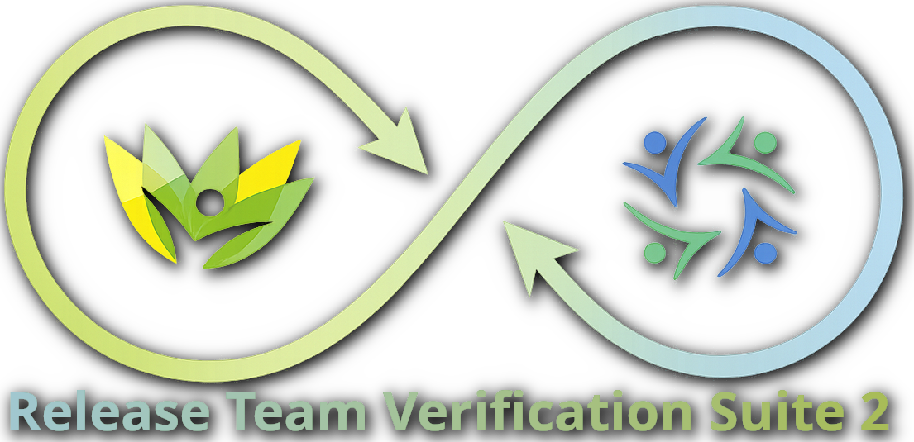

# Release Team Verification Suite 2 (RTVS)



A comprehensive automated testing framework built with Python, Selenium, and Pytest for web application testing and verification. This suite provides a robust Page Object Model (POM) architecture with advanced logging, database integration, and GUI-based test management.

## 🚀 Features

- **Page Object Model (POM) Architecture**: Organized and maintainable test structure
- **Advanced Logging System**: Detailed test execution logs with heartbeat monitoring
- **Database Integration**: SQLite-based test configuration and results management
- **GUI Test Controller**: Interactive test management interface
- **Multiple Browser Support**: Chrome, Firefox, Edge, and headless execution
- **Parameterized Testing**: Data-driven test execution
- **Custom Markers**: Organize tests by smoke, regression, and custom packages
- **HTML Reporting**: Detailed test execution reports
- **Screenshot Capture**: Automatic screenshot on test failures
- **Flexible Configuration**: Environment-based settings with `.env` support

## 📋 Prerequisites

- Python 3.8 or higher
- pip (Python package installer)
- Chrome/Firefox/Edge browser installed
- Git (for cloning the repository)

## 🛠️ Installation

### 1. Clone the Repository

```bash
git clone https://github.com/wdey-cz/release-team-verification-suite-2.git
cd release-team-verification-suite-2
```

### 2. Create Virtual Environment (Recommended)

```bash
# Windows
python -m venv venv
venv\Scripts\activate

# macOS/Linux
python3 -m venv venv
source venv/bin/activate
```

### 3. Install Dependencies

```bash
pip install -r requirements.txt
```

**Note**: If `requirements.txt` is not present, install these core dependencies:

```bash
pip install pytest selenium pytest-html webdriver-manager
```

### 4. Set Up Environment Variables

Create a `.env` file in the project root:

```bash
# Application settings
BASE_URL=https://www.wikipedia.org
TEST_ENV=PROD

# Browser settings
BROWSER=chrome
HEADLESS=false

# Timeout settings (in seconds)
DEFAULT_TIMEOUT=10
PAGE_LOAD_TIMEOUT=30
IMPLICIT_WAIT=0

# Test credentials
TEST_USERNAME=your_username
TEST_PASSWORD=your_password

# Reporting settings
SCREENSHOT_ON_FAILURE=true
SCREENSHOTS_DIR=screenshots
REPORTS_DIR=reports
LOG_LEVEL=INFO
```

## 📖 Usage

### Running Tests

#### Run All Tests

```bash
pytest tests/
```

#### Run Specific Test File

```bash
pytest tests/test_home_page.py
```

#### Run Tests by Marker

```bash
# Run smoke tests only
pytest -m smoke

# Run regression tests
pytest -m regression

# Run specific test package
pytest -m HomePageSearchRegressionPackage
```

#### Run Tests with Custom Options

```bash
# Verbose output
pytest tests/ -v

# Stop on first failure
pytest tests/ -x

# Run in headless mode
HEADLESS=true pytest tests/

# Generate HTML report
pytest tests/ --html=reports/report.html --self-contained-html
```

#### Run Parameterized Tests

```bash
# Run specific parameterized test
pytest tests/test_home_page.py::TestHomePage::test_search_suggestions
```

### Using the GUI Test Controller

Launch the interactive test management interface:

```bash
python config/controller_gui.py
```

The GUI allows you to:
- Configure test runs
- Select specific test suites
- Monitor test execution
- View test results and logs

### Debug Mode

Run tests in debug mode:

```bash
python run_debug.py
```

## 📁 Project Structure

```
release-team-verification-suite-2/
│
├── assets/                          # Static assets and resources
│   └── rtvs_database.db            # SQLite database for test management
│
├── config/                          # Configuration modules
│   ├── config_assists.py           # Configuration helper functions
│   ├── controller_gui.py           # GUI-based test controller
│   └── rtvsdb.py                   # Database management module
│
├── core/                            # Core framework components
│   ├── base_page.py                # Base Page Object class
│   ├── config.py                   # Configuration management
│   ├── driver_factory.py           # WebDriver initialization
│   ├── helpers.py                  # Utility helper functions
│   ├── rtvs_runner.py              # Test runner implementation
│   └── wait_helpers.py             # Explicit wait utilities
│
├── pages/                           # Page Object Model classes
│   ├── cozeva_login_page.py        # Login page object
│   └── wiki_homepage.py            # Wikipedia homepage object
│
├── tests/                           # Test cases
│   ├── test_home_page.py           # Homepage test suite
│   └── test_search.py              # Search functionality tests
│
├── conftest.py                      # Pytest fixtures and hooks
├── pytest.ini                       # Pytest configuration
├── README.md                        # This file
└── requirements.txt                 # Python dependencies
```

## ✍️ How to Add Tests

### Step 1: Create a Page Object

Create a new page object in the `pages/` directory:

```python
# pages/my_new_page.py

from core.base_page import BasePage
from selenium.webdriver.common.by import By


class MyNewPage(BasePage):
    """Page Object for My New Page."""
    
    # Locators
    SUBMIT_BUTTON = (By.ID, "submit-btn")
    INPUT_FIELD = (By.NAME, "input-field")
    RESULT_TEXT = (By.CSS_SELECTOR, ".result-text")
    
    def __init__(self, driver):
        super().__init__(driver)
        self.page_url = "/my-new-page"
    
    def navigate_to_page(self):
        """Navigate to the page."""
        self.driver.get(self.base_url + self.page_url)
    
    def enter_text(self, text):
        """Enter text in the input field."""
        self.wait_for_element(self.INPUT_FIELD)
        self.driver.find_element(*self.INPUT_FIELD).send_keys(text)
    
    def click_submit(self):
        """Click the submit button."""
        self.click_element(self.SUBMIT_BUTTON)
    
    def get_result_text(self):
        """Get the result text."""
        return self.get_element_text(self.RESULT_TEXT)
```

### Step 2: Create a Test File

Create a new test file in the `tests/` directory:

```python
# tests/test_my_new_feature.py

import pytest
from pages.my_new_page import MyNewPage


@pytest.mark.regression
class TestMyNewFeature:
    """Test cases for My New Feature."""
    
    def test_submit_form(self, session_driver, base_url, config_assists):
        """Test form submission functionality."""
        
        # Test setup
        driver = session_driver
        rc = config_assists.get_run_configuration()
        failed_cases = 0
        
        # Initialize page object
        page = MyNewPage(driver)
        page.navigate_to_page()
        
        config_assists.add_log_update(
            message=f"Navigated to page for {rc.test_name}",
            driver=driver
        )
        
        # Test Case 1: Enter text and submit
        config_assists.add_log_heartbeat("Testing form submission", driver=driver)
        page.enter_text("Test Input")
        page.click_submit()
        
        result = page.get_result_text()
        if "Success" in result:
            config_assists.add_log_test_case(
                message="Form submission successful",
                status='PASSED',
                driver=driver
            )
        else:
            config_assists.add_log_test_case(
                message="Form submission failed",
                status='FAILED',
                driver=driver
            )
            failed_cases += 1
        
        # Final assertion
        assert failed_cases < 1, f"{failed_cases} test cases failed"
```

### Step 3: Add Custom Markers (Optional)

Add custom markers in `pytest.ini`:

```ini
markers =
    smoke: Quick smoke tests
    regression: Full regression tests
    my_feature: My new feature tests
```

### Step 4: Run Your New Tests

```bash
# Run all tests in the new file
pytest tests/test_my_new_feature.py

# Run with marker
pytest -m my_feature
```

## 🎯 Test Writing Best Practices

1. **Use Page Objects**: Always create Page Objects for new pages
2. **Single Assert**: Each test function should have only one final assert
3. **Logging**: Use `config_assists` for detailed logging
4. **Error Handling**: Use try-except blocks for complex operations
5. **Cleanup**: Use fixtures for setup and teardown
6. **Markers**: Tag tests appropriately for organization
7. **Parameterization**: Use `@pytest.mark.parametrize` for data-driven tests
8. **Descriptive Names**: Use clear, descriptive test and method names

## 📊 Available Pytest Markers

- `smoke`: Quick smoke tests
- `regression`: Full regression tests
- `HomePageSearchRegressionPackage`: Homepage search tests
- `HomePageLanguagesRegressionPackage`: Homepage language tests
- `HomePageComboPack1`: Combined homepage test package
- `login`: Login-related tests
- `dashboard`: Dashboard-related tests
- `registries`: Registries-related tests

## 🐛 Troubleshooting

### WebDriver Issues

If you encounter WebDriver issues:

```bash
# Install/update webdriver-manager
pip install --upgrade webdriver-manager
```

### Browser Not Found

Ensure the browser is installed:
- Chrome: Download from https://www.google.com/chrome/
- Firefox: Download from https://www.mozilla.org/firefox/
- Edge: Pre-installed on Windows 10/11

### Import Errors

Make sure you're running from the project root:

```bash
cd /path/to/release-team-verification-suite-2
pytest tests/
```

## 📝 License

This project is proprietary and confidential.

## 🤝 Contributing

1. Create a feature branch
2. Add your tests following the style guide
3. Ensure all tests pass
4. Submit a pull request

## 📧 Contact

For questions or support, contact the Release Team.

---

**Happy Testing! 🎉**
